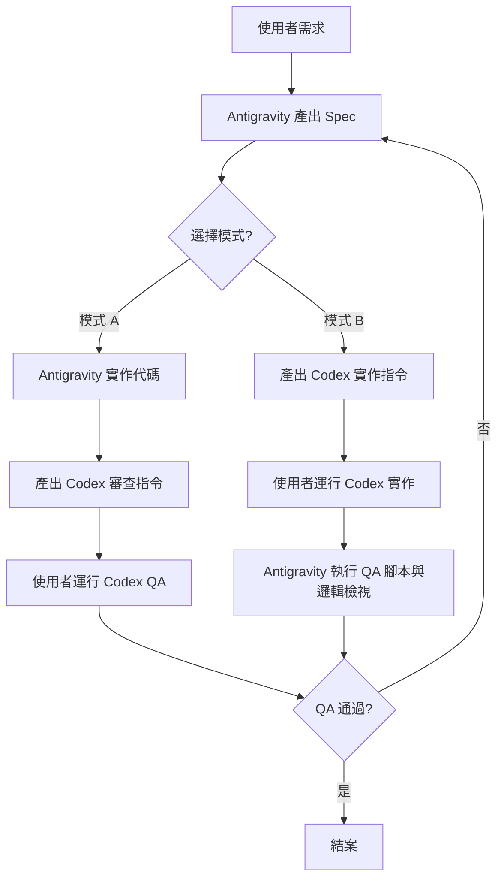

# 🤖 AI 協作戰略指南 (Commander Mode)

## 1. 角色定義 (Roles)

### 🚩 總司令：Antigravity (IDE Agent)
- **職責**：理解 `ivy_house_rules.md`、維護 `Implementation_Plan.md`、撰寫 `Dev Spec`、執行 QA。
- **特點**：具備全域視角，擁有最強的邏輯檢查能力。
- **任務觸發**：對話框輸入、`/dev`（相容 `/dev-team`）工作流。

### 🔫 前線士兵：Codex CLI (Terminal)
- **職責**：根據 Spec 執行代碼撰寫、重構、存檔。
- **特點**：專注於執行力，消耗使用者專屬會員額度。
- **任務觸發**：接收總司令下達的 `codex edit` 或 `codex ask` 指令。

## 2. 協作循環 (Collaboration Loop)

### 📌 交叉審核鐵律 (Cross-Audit Rule)
> **「不互為裁判與球員」**：負責實作代碼的 Agent 不得擔任該次任務的終審 QA。

| 模式 | 實作 Agent (Writer) | 審核 Agent (Reviewer) | 執行方式 |
| :--- | :--- | :--- | :--- |
| **模式 A** | Antigravity IDE | Codex CLI | Antigravity 實作後，生成指令由 Codex 進行反向審查 |
| **模式 B** | Codex CLI | Antigravity IDE | Codex 於終端機實作，由 Antigravity 進行文件化審查與腳本驗證 |

## 3. 指令規範 (Command Standards)

為了確保士兵（Codex）具備 Agent 意識並能善用 Skills，總司令產出的指令必須遵循：

### 📌 四大鐵律 (Core Requirements)
1. **`--instruction "所有註釋必須使用繁體中文"`**
2. **`--instruction "單檔必須控制在 500 行以內"`**
3. **`--instruction "禁止 Hard-code API Key"`**
4. **`--instruction "遵守 .agent/ 內的所有角色規範與技能限制"`** (New!)

### 📌 技能注入 (Skill Injection)
當任務涉及特定工具時，總司令應將工具權限「注入」指令：
- **範例**：若任務需要 Code Review，指令應包含：
  `... --instruction "修改完畢後，請主動執行 python .agent/skills/code_reviewer.py <file> 驗證結果"`

### 📌 角色賦能 (Context Injection)
指令應開宗明義定義 Codex 此刻的角色：
- **範例**：`codex edit ... --instruction "你現在是 .agent/roles/engineer.md 定義的艾薇全端工程師，請執行以下實作..."`

- **共享資料夾**：`.agent/skills/`
- **調用方式**：總司令指令 Codex 執行該目錄下的 `.py` 修改工具。
- **審計**：所有執行結果由總司令記錄於 `audit.log`。
