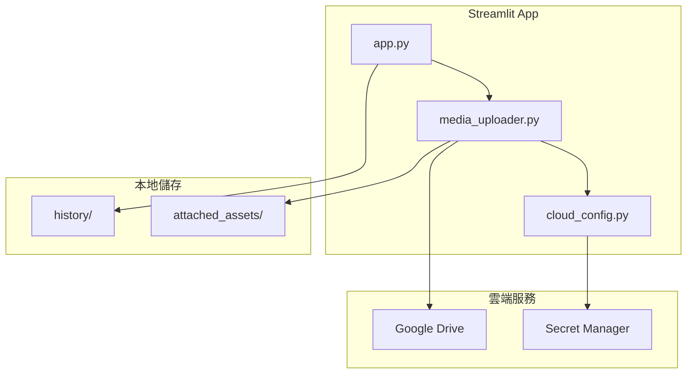
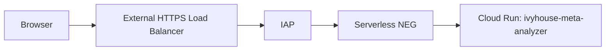

<!--
檔案用途：雲端整合策略文件
職責：
  - 定義 Google Drive 與 Secret Manager 整合架構
  - 說明 MCP 優先、REST API 備援的策略
  - 定義認證流程、權限範圍與 Token 生命週期
-->

# 雲端整合策略 (Phase 2.3)

**最後更新**：2026-01-04

---

## 1. 整體架構



### 1.1 私有網站入口（Idx-051）



- 本專案目前已驗證可用的瀏覽器入口為 `External HTTPS Load Balancer + IAP`，不是 app 內 login 頁。
- direct IAP on Cloud Run 雖然文件上存在，但此 project 不屬於 organization，因此無法採用。
- 目前驗證入口使用 self-signed certificate + static IP；正式環境應切到自訂網域 + Google-managed certificate。
- Cloud Run 已收斂為 `internal-and-cloud-load-balancing` ingress，避免外部直接經由 `run.app` 旁路。
- 2026-03-07 已完成 customer-owned OAuth client 修復：Google Auth Platform 上建立的 Web OAuth client 可支撐 live browser flow，並已成功完成帳戶選擇、OAuth 同意與首頁載入。

---

## 2. Google Drive 整合

### 2.1 優先方案：MCP Server

> [!TIP]
> MCP (Model Context Protocol) 是 Anthropic 推動的標準化 Agent-to-Tool 協定，可讓 AI Agent 安全地調用外部工具。

**搜尋目標**：
- GitHub 上的 `google-drive-mcp` 或 `gdrive-mcp-server`
- 功能需求：檔案上傳、下載、列表、搜尋

**評估標準**：
1. 是否支援 Service Account 或 OAuth 認證？
2. 是否有活躍維護（最近 6 個月有 commit）？
3. 是否有明確的安全授權機制？

### 2.2 備援方案：傳統 REST API

若無適合的 MCP，則使用 `scripts/media_uploader.py` 中已實作的 Google Drive REST API v3 橋接層。

**認證方案選擇**：

| 方案 | 適用情境 | Token 來源 | 生命週期 |
|------|----------|------------|----------|
| **OAuth 2.0 使用者授權** | 個人帳號、需要使用者授權 | Refresh Token 自動刷新 | Access Token 1 小時 |
| **Service Account (SA)** | 自動化、伺服器對伺服器 | SA JSON → JWT 交換 Token | Access Token 1 小時 |

**推薦流程 (Service Account)**：
1. 在 GCP Console 建立 Service Account
2. 下載 JSON 金鑰檔（**不可 commit 到 Git**）
3. 將金鑰檔放在 `.gitignore` 涵蓋的路徑（例如 `secrets/`）
4. 在 `ifp.env` 設定金鑰路徑：
   ```bash
   GOOGLE_APPLICATION_CREDENTIALS=./secrets/sa-key.json
   GOOGLE_DRIVE_FOLDER_ID=<folder_id>
   ```
5. 將目標 Drive 資料夾「共用」給 SA 的電子郵件（`xxx@project.iam.gserviceaccount.com`）

**Token 刷新機制**：
- 使用 `google-auth` 套件自動處理 JWT → Access Token 交換
- Token 有效期 1 小時，套件會在過期前自動刷新

---

## 3. Google Secret Manager 整合

### 3.1 目標：Git 零金鑰原則

> [!IMPORTANT]
> 所有敏感資訊（API Key、OAuth Token、Service Account JSON）都不得存入 Git 儲存庫。

**遷移計畫**：

| 金鑰 | 目前位置 | 目標位置 | IAM 角色 |
|------|----------|----------|----------|
| `OPENROUTER_API_KEY` | `ifp.env` | Secret Manager | `roles/secretmanager.secretAccessor` |
| SA JSON | 本地檔案 | Secret Manager | `roles/secretmanager.secretAccessor` |

### 3.2 優先方案：MCP Server

搜尋 `gcp-secret-manager-mcp` 或類似專案，評估其是否支援：
- `get_secret` 操作
- IAM 角色授權

### 3.3 備援方案：Python SDK

若無 MCP，則使用 `google-cloud-secret-manager` Python 套件：
```python
from google.cloud import secretmanager

def get_secret(project_id: str, secret_id: str, version: str = "latest") -> str:
    client = secretmanager.SecretManagerServiceClient()
    name = f"projects/{project_id}/secrets/{secret_id}/versions/{version}"
    response = client.access_secret_version(request={"name": name})
    return response.payload.data.decode("UTF-8")
```

---

## 4. 環境變數與權限範圍

### 4.1 環境變數清單

```bash
# =========================
# 雲端媒體上傳 (Stage 1)
# =========================
CLOUD_MEDIA_PROVIDER=none                      # none / gdrive
GOOGLE_DRIVE_FOLDER_ID=                        # 目標資料夾 ID
GOOGLE_APPLICATION_CREDENTIALS=                # SA JSON 路徑 (推薦)

# =========================
# Secret Manager (Stage 3)
# =========================
SECRET_MANAGER_ENABLED=false
GCP_PROJECT_ID=

# =========================
# HTTP 參數
# =========================
CLOUD_HTTP_TIMEOUT_S=120
```

### 4.2 OAuth Scopes (最小權限原則)

| 服務 | Scope | 用途 |
|------|-------|------|
| Google Drive | `https://www.googleapis.com/auth/drive.file` | 僅存取本 App 建立的檔案 |
| Secret Manager | `https://www.googleapis.com/auth/cloud-platform` | 讀取 Secret |

### 4.3 IAP / Web 入口最小權限

| Principal | Role | 用途 |
|------|------|------|
| `service-971489052398@gcp-sa-iap.iam.gserviceaccount.com` | `roles/run.invoker` | 允許 IAP 代表使用者呼叫後端 Cloud Run |
| 已授權使用者 / Service Account | `roles/iap.httpsResourceAccessor` | 綁定於 IAP backend service 資源層級，允許通過 IAP 存取單一網站入口 |

### 4.4 OAuth Client 注意事項

- 舊 `gcloud iap oauth-brands` / `gcloud iap oauth-clients` 路線已被官方標示將淘汰，且在本專案會被 `Project must belong to an organization` 阻擋。
- `gcloud alpha iam oauth-clients` 曾作為探查用 generic client API，但最終正式 browser flow 仍需 Google Auth Platform 建立的 customer-owned Web OAuth client。
- IAP 實際使用的 redirect URI 必須是：
    - `https://iap.googleapis.com/v1/oauth/clientIds/<CLIENT_ID>:handleRedirect`
- OAuth client secret 屬敏感資訊，必須放在 Secret Manager 或其他安全儲存，不得寫入 repo。
- 目前正式 client 已改為 `971489052398-untjbrcfdlqc5bg61hbce6aigeia033e.apps.googleusercontent.com`；live 入口實測可成功導向 Google OAuth 並回到應用首頁。

### 4.5 上傳後追蹤與回滾

- 每次上傳成功後，將 `{local_path, remote_id, sha256_8}` 寫入 `upload_manifest.json`
- 回滾時可依 `remote_id` 刪除雲端檔案

---

## 5. 下一步行動

- [ ] **Stage 3-1**：搜尋 Google Drive MCP Server（使用 `github_explorer.py`）
- [ ] **Stage 3-2**：搜尋 Secret Manager MCP Server
- [ ] **Stage 3-3**：若無 MCP，則實作 `scripts/gdrive_bridge.py` 傳統橋接
- [ ] **Stage 3-4**：更新 `ifp.env.example` 範本

---

## 6. 安全注意事項

> [!CAUTION]
> - 絕對不要將 `ifp.env`、`secrets/` 或任何金鑰檔案 commit 到 Git。
> - SA JSON 必須存放在 `.gitignore` 涵蓋的路徑。
> - Access Token 有效期 1 小時，使用 `google-auth` 套件自動刷新。
> - 定期輪替 SA 金鑰（建議每 90 天），並在 GCP Console 停用舊金鑰。
